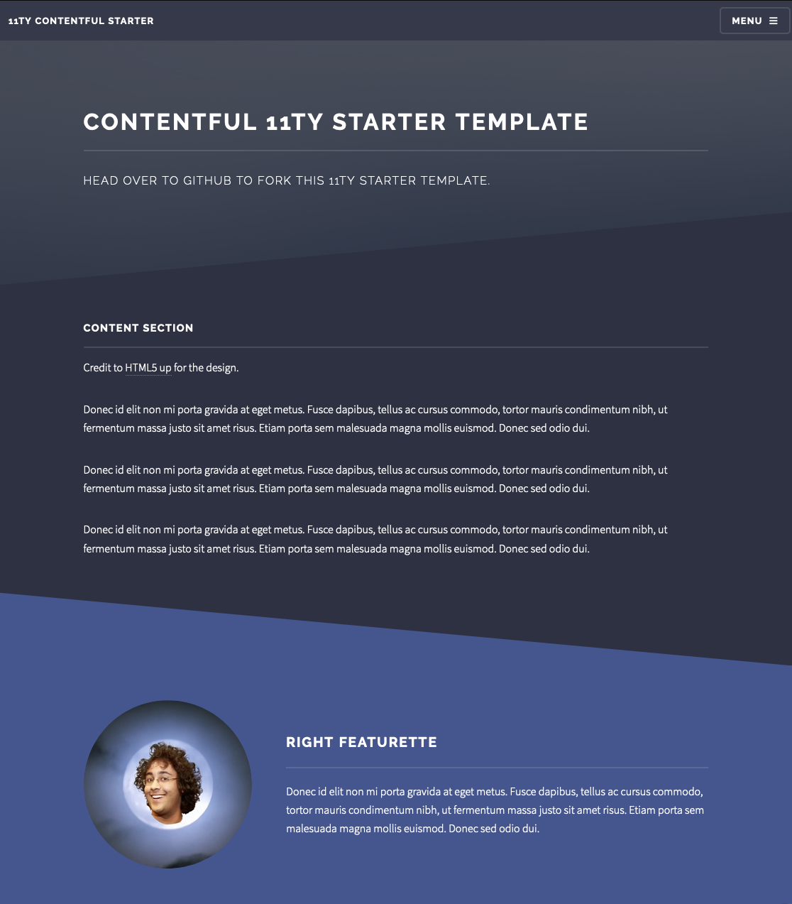
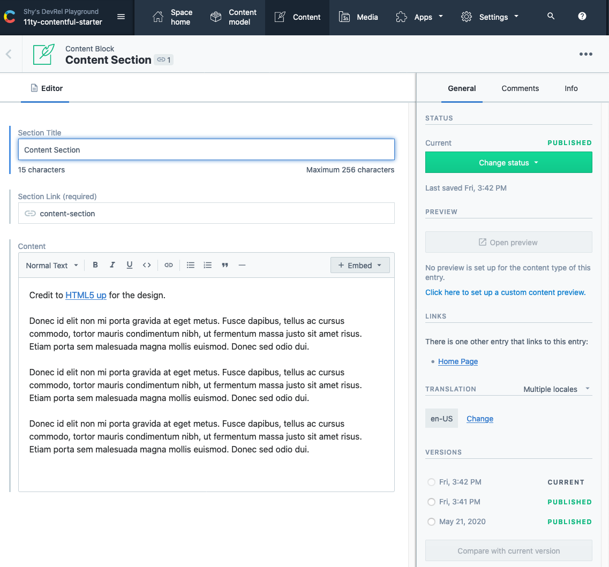
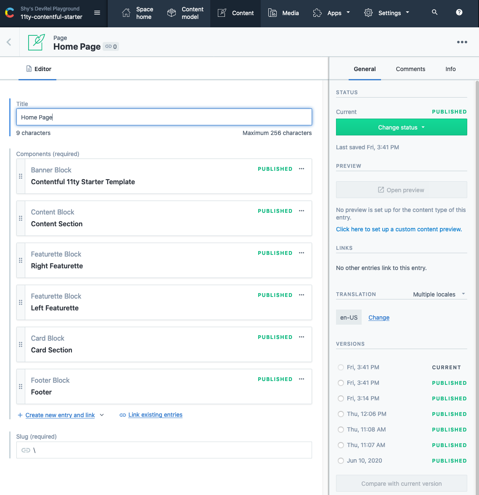

11ty-contentful-starter
=====

An example site made using [Contentful](https://www.contentful.com/) and [11ty](https://www.11ty.dev/). It's automatically deployed via GitHub Actions and then hosted by GitHub Pages. Data lives in Contentful, code lives with GitHub, and that's all the services you need to deploy and host a static site.



What is this about?
=====

This example contains [11ty Javascript Data Files](https://www.11ty.dev/docs/data-js/) that take Contentful provided content to build a webpage. The front end utilizes [the HTML5UP Solid State theme](https://html5up.net/solid-state) for layout and styling. When code is committed or content is published, a build process is triggered that utilizes [GitHub Actions for GitHub Pages](https://github.com/peaceiris/actions-gh-pages) to build and deploy the website.


Getting started
=====

### Requirements

To deploy this project you'll need accounts for the following services:

- [Contentful](https://www.contentful.com)
- GitHub

### Setup

* Fork and clone this repository

#### The Contentful part (optional)

This repo currently uses an existing Contentful space configured in the [.env](.env) file. If you'd like to replace this space with your own, so you can modify the content, you're welcome to do so.

* Create a new space using the [Contentful CLI](https://github.com/contentful/contentful-cli)

```console
$ contentful space create --name "11ty-contentful-starter"
? Do you want to confirm the space creation? Yes
Your user account is a member of multiple organizations. Please select the organization you would like to add your Space to.
? Please select an organization: Shy's DevRel Playground (orgid)
✨  Successfully created space 11ty-contentful-starter (rea8ci0yln66)
```
* Set the newly created space as default space for all further CLI operations. You'll be presented with a list of all available spaces – choose the one you just created.
```console
$ contentful space use
? Please select a space: 11ty-contentful-starter (rea8ci0yln66)
Now using the 'master' Environment of Space 11ty-contentful-starter (rea8ci0yln66) when the `--environment-id` option is missing.
```

* Import the provided content model (`./import/export.json`) into the newly created space.
```console
$ contentful space import --content-file import/export.json
┌──────────────────────────────────────────────────┐
│ The following entities are going to be imported: │
├────────────────────────────────┬─────────────────┤
│ Content Types                  │ 7               │
├────────────────────────────────┼─────────────────┤
│ Editor Interfaces              │ 7               │
├────────────────────────────────┼─────────────────┤
│ Entries                        │ 12              │
├────────────────────────────────┼─────────────────┤
│ Assets                         │ 6               │
├────────────────────────────────┼─────────────────┤
│ Locales                        │ 1               │
├────────────────────────────────┼─────────────────┤
│ Webhooks                       │ 0               │
└────────────────────────────────┴─────────────────┘
 ✔ Validating content-file
 ✔ Initialize client (1s)
 ✔ Checking if destination space already has any content and retrieving it (7s)
 ✔ Apply transformations to source data (1s)
 ✔ Push content to destination space
   ✔ Connecting to space (1s)
   ✔ Importing Locales (1s)
   ✔ Importing Content Types (1s)
   ✔ Publishing Content Types (4s)
   ✔ Importing Editor Interfaces (1s)
   ✔ Importing Assets (7s)
   ✔ Publishing Assets (2s)
   ✔ Archiving Assets (1s)
   ✔ Importing Content Entries (3s)
   ✔ Publishing Content Entries (5s)
   ✔ Archiving Entries (0s)
   ✔ Creating Web Hooks (1s)
Finished importing all data
┌────────────────────────┐
│ Imported entities      │
├───────────────────┬────┤
│ Locales           │ 1  │
├───────────────────┼────┤
│ Content Types     │ 7  │
├───────────────────┼────┤
│ Editor Interfaces │ 7  │
├───────────────────┼────┤
│ Assets            │ 6  │
├───────────────────┼────┤
│ Published Assets  │ 6  │
├───────────────────┼────┤
│ Archived Assets   │ 0  │
├───────────────────┼────┤
│ Entries           │ 12 │
├───────────────────┼────┤
│ Published Entries │ 12 │
├───────────────────┼────┤
│ Archived Entries  │ 0  │
├───────────────────┼────┤
│ Webhooks          │ 0  │
└───────────────────┴────┘
The import took a few seconds (27s)

The import was successful.
```

* For this project we have a few different Content Types on Contentful.
  * This example has a few different content types appended with the word `Block`. `bannerBlock`, `cardBlock`, `contentBlock`, `featuretteBlock` and `footerBlock` all represent individual components used to create a page. You can create as many of them as you'd like.
  * 
  * `Page` is used to manage the layout for individual pages and also build the routes for the site. You can add individual `Block` content to create the page layout. By rearranging the blocks you can adjust the order of the page itself. The slug style section link is used to manage routing on the site. You can have multiple instances of this content type. When you publish a page it'll automatically be added to the menu.
  * 

* Update the space id and access token in [.env](.env) to use the api keys from your newly created space.

#### Build the site

* On the command line, navigate to your cloned repo and install your dependencies with `npm install`.
* Run Eleventy with `npx eleventy --serve`. We're using the `--serve` argument so eleventy will host the site for us. Navigiate to [localhost:8080](http://localhost:8080) (or whatever port 11ty provides you if 8080 is already in use) to view the site.
```console
$ npx eleventy --serve
Writing _site/README/index.html from ./README.md.
Writing _site/index.html from ./pages.liquid.
Writing _site/second-page/index.html from ./pages.liquid.
Benchmark (Data): `./_data/contentful-page.js` took 6107ms (88.6%)
Copied 2 items / Wrote 3 files in 6.72 seconds (v0.10.0)
Watching…
[Browsersync] Access URLs:
 --------------------------------------
       Local: http://localhost:8080
    External: http://192.168.1.137:8080
 --------------------------------------
          UI: http://localhost:3001
 UI External: http://localhost:3001
 --------------------------------------
[Browsersync] Serving files from: _site
```

#### The GitHub part (optional)

Since we're using GitHub Actions, we'll be able to use the existing [GitHub Actions for GitHub Pages](https://github.com/peaceiris/actions-gh-pages) repo.

The implementation is identical to our other [11ty and Contentful examples](https://github.com/contentful/11ty-contentful-gallery) and we have a full write up [detailing how to configure static sites with GitHub pages on our blog](https://www.contentful.com/blog/2020/06/01/running-static-site-builds-with-github-actions-and-contentful/) if you'd like to deploy this site via GitHub pages. If you do follow the instructions in these examples it's important to note that if you've changed the name of this repo or set up a custom domain you'll need to adjust the `pathprefix` in the package.json.


Implementation Notes
=======


* This example uses one layout:
  - [_includes\layout.liquid.html](_includes\layout.liquid.html): the top level HTML structure
 * This example uses [liquid](https://www.11ty.dev/docs/languages/liquid/) templates to generate pages.
  - [contentful-page.js](_data/contentful-page.js) reaches out to Contentful and pulls in all entries of Content Type page. This is passed on to the pages.liquid file to handle generating the site.
  - In Contentful, pages are handled by the page content type.
    - The page content type, contains a title, slug (for routing) and a reference field that take Content Types appended with the word `Block`.
    - Each of these blocks map to page components.
    - Each block type is handled by an eleventy shortcode that takes the block and converts it into HTML.
    - The order of the blocks inside the reference field determines the order of the components on a page.
- [pages.liquid](pages.liquid) generates all the pages.
* This example is deployed using GitHub pages, but not to the root `contentful.github.io` domain. We're able to use the [Path Prefix settings](https://www.11ty.dev/docs/config/#deploy-to-a-subdirectory-with-a-path-prefix) to support deploying to a sub-directory. This is managed by the [package.json](package.json).

Config Files
=======

This repo comes with an existing [.env](.env) file to handle environment variables. `GOOGLE_TRACKING_ID` is optional if you'd like to add analytics to your website. `CTFL_SPACE` and `CTFL_ACCESSTOKEN` map to your Contentful API keys. This repo comes with those variables already provided to an existing Contentful space that you can use to see what the site looks like. If you'd like to adjust the Content or Content Models, you'll need to follow the export instructions about and replace these two environment variables with your own.

License
=======

Copyright (c) 2020 Contentful GmbH. Code released under the MIT license. See [LICENSE](LICENSE) for further details.
