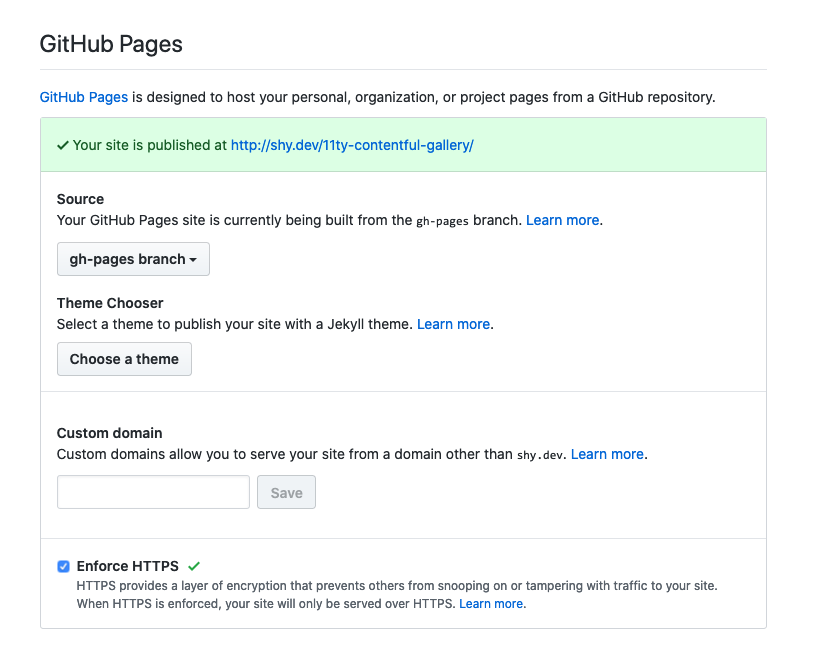
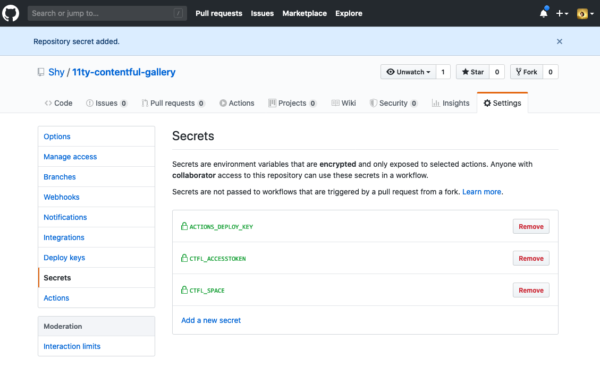
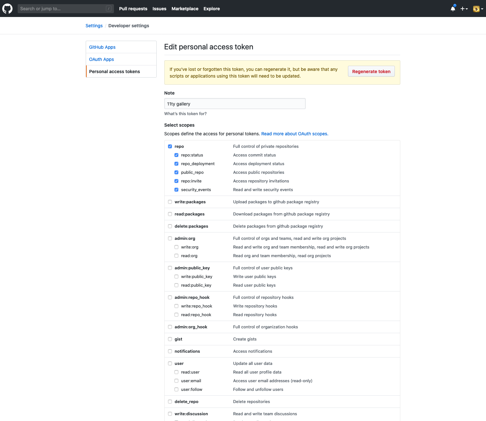
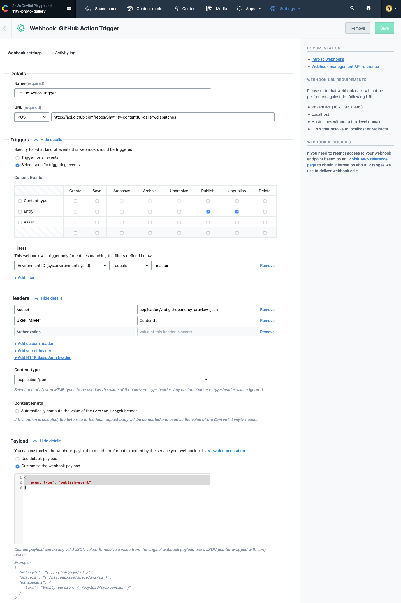
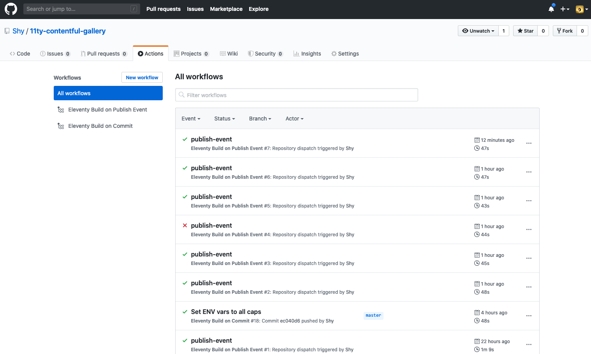

11ty-contentful-starter
=====

An example site made using [Contentful](https://www.contentful.com/) and [11ty](https://www.11ty.dev/). It's automatically deployed via GitHub Actions and then hosted by GitHub Pages. Data lives in Contentful, code lives with GitHub, and that's all the services you need to deploy and host a static site.


What is this about?
=====

This example contains [11ty Javascript Data Files](https://www.11ty.dev/docs/data-js/) that take Contentful provided content to build a webpage. The front end utilizes [the HTML5UP Solid State theme](https://html5up.net/solid-state) for layout and styling. When code is committed or content is published, a build process is triggered that utilizes [GitHub Actions for GitHub Pages](https://github.com/peaceiris/actions-gh-pages) to build and deploy the website.


Getting started
=====

### Requirements

To deploy this project you'll need accounts for the following services:

- [Contentful](https://www.contentful.com)
- GitHub

### Setupmv

* Fork and clone this repository

#### The Contentful part (optional)

This repo currently uses an existing Contentful space configured in the [.env](.env) file. If you'd like to replace this space with your own, so you can modify the content, you're welcome to do so.

* Create a new space using the [Contentful CLI](https://github.com/contentful/contentful-cli)

```console
$ contentful space create --name "11ty-contentful-starter"
? Do you want to confirm the space creation? Yes
Your user account is a member of multiple organizations. Please select the organization you would like to add your Space to.
? Please select an organization: Shy's DevRel Playground (orgid)
✨  Successfully created space 11ty-contentful-starter (rea8ci0yln66)
```
* Set the newly created space as default space for all further CLI operations. You'll be presented with a list of all available spaces – choose the one you just created.
```console
$ contentful space use
? Please select a space: 11ty-contentful-starter (rea8ci0yln66)
Now using the 'master' Environment of Space 11ty-contentful-starter (rea8ci0yln66) when the `--environment-id` option is missing.
```

* Import the provided content model (`./import/export.json`) into the newly created space.
```console
$ contentful space import --content-file import/export.json
┌──────────────────────────────────────────────────┐
│ The following entities are going to be imported: │
├────────────────────────────────┬─────────────────┤
│ Content Types                  │ 7               │
├────────────────────────────────┼─────────────────┤
│ Editor Interfaces              │ 7               │
├────────────────────────────────┼─────────────────┤
│ Entries                        │ 12              │
├────────────────────────────────┼─────────────────┤
│ Assets                         │ 6               │
├────────────────────────────────┼─────────────────┤
│ Locales                        │ 1               │
├────────────────────────────────┼─────────────────┤
│ Webhooks                       │ 0               │
└────────────────────────────────┴─────────────────┘
 ✔ Validating content-file
 ✔ Initialize client (1s)
 ✔ Checking if destination space already has any content and retrieving it (7s)
 ✔ Apply transformations to source data (1s)
 ✔ Push content to destination space
   ✔ Connecting to space (1s)
   ✔ Importing Locales (1s)
   ✔ Importing Content Types (1s)
   ✔ Publishing Content Types (4s)
   ✔ Importing Editor Interfaces (1s)
   ✔ Importing Assets (7s)
   ✔ Publishing Assets (2s)
   ✔ Archiving Assets (1s)
   ✔ Importing Content Entries (3s)
   ✔ Publishing Content Entries (5s)
   ✔ Archiving Entries (0s)
   ✔ Creating Web Hooks (1s)
Finished importing all data
┌────────────────────────┐
│ Imported entities      │
├───────────────────┬────┤
│ Locales           │ 1  │
├───────────────────┼────┤
│ Content Types     │ 7  │
├───────────────────┼────┤
│ Editor Interfaces │ 7  │
├───────────────────┼────┤
│ Assets            │ 6  │
├───────────────────┼────┤
│ Published Assets  │ 6  │
├───────────────────┼────┤
│ Archived Assets   │ 0  │
├───────────────────┼────┤
│ Entries           │ 12 │
├───────────────────┼────┤
│ Published Entries │ 12 │
├───────────────────┼────┤
│ Archived Entries  │ 0  │
├───────────────────┼────┤
│ Webhooks          │ 0  │
└───────────────────┴────┘
The import took a few seconds (27s)


The following 0 errors and 11 warnings occurred:

10:10:44 - Rate limit error occurred. Waiting for 1582 ms before retrying...
10:10:44 - Rate limit error occurred. Waiting for 1507 ms before retrying...
10:10:45 - Rate limit error occurred. Waiting for 1543 ms before retrying...
10:10:45 - Rate limit error occurred. Waiting for 1594 ms before retrying...
10:10:47 - Rate limit error occurred. Waiting for 1579 ms before retrying...
10:10:68 - Rate limit error occurred. Waiting for 1660 ms before retrying...
10:10:69 - Rate limit error occurred. Waiting for 1524 ms before retrying...
10:10:70 - Rate limit error occurred. Waiting for 1584 ms before retrying...
10:10:78 - Rate limit error occurred. Waiting for 1654 ms before retrying...
10:10:79 - Rate limit error occurred. Waiting for 1661 ms before retrying...
10:10:80 - Rate limit error occurred. Waiting for 1639 ms before retrying...
The import was successful.
```

* For this project we have a few different Content Types on Contentful.
  * This example has a few different content types apended with the word `Block`. `bannerBlock`, `cardBlock`, `contentBlock`, `featuretteBlock` and `footerBlock` all represent individual components used to create a page. You can create as many of them as you'd like.
  * 
  * `Page` is used to manage the layout for individual pages and also build the routes for the site. You can add individual `Block` content to create the page layout. By rearranging the blocks you can adjust the order of the page itself. The slug style section link is used to manage routing on the site. You can have multiple instances of this content type. When you publish a page it'll automatically be added to the menu.
  * 

* Update the space id and access token in [.env](.env) to use the api keys from your newly created space.

#### Build the site

* On the command line, navigate to your cloned repo and install your dependencies with `npm install`.
* Run Eleventy with `npx eleventy --serve`. We're using the `--serve` argument so eleventy will host the site for us. Navigiate to [localhost:8080](http://localhost:8080) (or whatever port 11ty provides you if 8080 is already in use) to view the site.
```console
$ npx eleventy --serve
Writing _site/README/index.html from ./README.md.
Writing _site/index.html from ./pages.liquid.
Writing _site/second-page/index.html from ./pages.liquid.
Benchmark (Data): `./_data/contentful-page.js` took 6107ms (88.6%)
Copied 2 items / Wrote 3 files in 6.72 seconds (v0.10.0)
Watching…
[Browsersync] Access URLs:
 --------------------------------------
       Local: http://localhost:8080
    External: http://192.168.1.137:8080
 --------------------------------------
          UI: http://localhost:3001
 UI External: http://localhost:3001
 --------------------------------------
[Browsersync] Serving files from: _site
```

#### The GitHub part (optional)

Since we're using GitHub Actions, we'll be able to use the existing [GitHub Actions for GitHub Pages](https://github.com/peaceiris/actions-gh-pages) repo. This repo contains a build script that will trigger when you make a [push](.github/workflows/push_build.yml) and one that can be triggered [via a webhook from Contentful](.github/workflows/contentful_build.yml). This build will run eleventy and then publish your site to the `gh_pages` branch of your repo. You'll need to adjust or delete the final cname line (`cname: shy.dev`) in both build scripts or it'll cause a 404 with GitHub Pages.



On your forked repo you'll need to [add an SSH Deploy key so GitHub actions will be able to deploy to GitHub pages](https://github.com/peaceiris/actions-gh-pages#%EF%B8%8F-create-ssh-deploy-key). This should be a new SSH Key that you only use in this context. Don't reuse your existing GitHub SSH keys if you've got one. Lastly add the environment variables for Contentful in the GitHub Secrets page. Optionally you can activate Google Analytics tracking by including your `GOOGLE_TRACKING_ID` in the GitHub Secrets page.



That's everything we need for building on a push to the repo. We've got a few more steps to make it so Contentful is able to trigger a rebuild. In your GitHub Developer settings create a new personal access token and give it the repo scope.



Head over to your Contentful space and in the settings menu acess the Webhooks section page click Add Webhook. Name it `GitHub Action Trigger`. For the URL make sure your using a POST call with the URL as `https://api.github.com/repos/{GitHub User Name}/{Your Repo Name}/dispatches` replacing `{GitHub User Name}` and `{Your Repo name}` with the information from your repo. Set the triggers to be just for Publish & Unpublish events on Entries. Add the following 3 headers, `Accept: application/vnd.github.mercy-preview+json`, `USER-AGENT: Contentful`, and `Authorization: Bearer {GitHub Personal Access Token}` replacing `{GitHub Personal Access Token}` with the token you generated in your developer settings. Lastly set the Content type to `application/json` and the payload to custom with the following json blob `{"event_type": "publish-event"}`.



Hit Save and now when you hit publish on any entry it'll trigger a rebuild via GitHub Actions.




Implementation Notes
=======

* This example uses one layout:
    - [_includes\layout.liquid.html](_includes\layout.liquid.html): the top level HTML structure
 * This example uses [liquid](https://www.11ty.dev/docs/languages/liquid/) templates to generate pages.
   - [pages.liquid](pages.liquid) generates all the pages.
   - Each block type is handled by an eleventy shortcode that takes the block and converts it into HTML.

License
=======

Copyright (c) 2020 Contentful GmbH. Code released under the MIT license. See [LICENSE](LICENSE) for further details.
